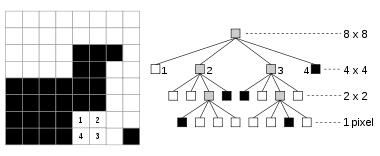

# Quadtree Exercice 🌳

## Description 📝
Ce projet consiste en la création d'un Quadtree à partir de données et en sa représentation graphique en utilisant Tkinter. Fait dans le cadre du Module Python du Bachelor IT - SysOps à l'EPSI.

## Exercice : Arbre quaternaire
Un quadtree ou arbre quaternaire (arbre Q) est une structure de données de type arbre dans laquelle chaque nœud a quatre fils. Les quadtrees sont le plus souvent utilisés pour partitionner un espace bidimensionnel en le subdivisant récursivement en quatre nœuds. 

Il existe plusieurs types de quadtree. Dans notre cas il s'agit d'un quadtree "region".
Le quadtree «région» représente une partition de l'espace en deux dimensions en décomposant la région en quatre quadrants égaux, puis chaque quadrant en quatre sous-quadrants, et ainsi de suite, avec chaque «nœud terminal» comprenant des données correspondant à une sous-région spécifique. Chaque nœud de l'arbre a exactement : soit quatre enfants, soit aucun (cas d'un nœud terminal).
Chaque `Noeud` comportant quatre éléments. Il s'agit d'une technique connue pour l'encodage d'images.  Pour simplifier, les images sont carrées, de couleur noir et blanc 
et de côté 2^n.

## Installation ⚙️
1. Assurez-vous d'avoir Python installé.
2. Clonez le dépôt Git : `git clone https://github.com/NxRitsu/Quadtree-Exercice.git`
3. Installez les dépendances à l'aide de `pip` : `pip install -r requirements.txt`

## Utilisation 🚀
1. Exécutez le script principal : `python quadtree.py`
2. Suivez les instructions pour charger les données et visualiser le Quadtree.

## Exemple de données 📊
Les données du Quadtree sont stockées dans un fichier `quadtree.txt`. Il est possible de personnaliser ce fichier avec vos propres données.

## Auteur 👤
Melvin 🧑‍💻
